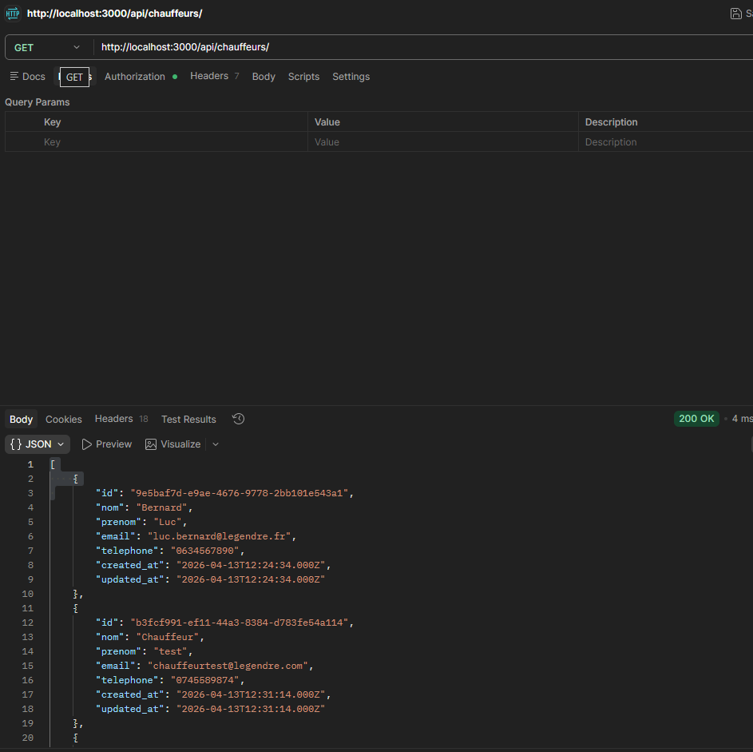
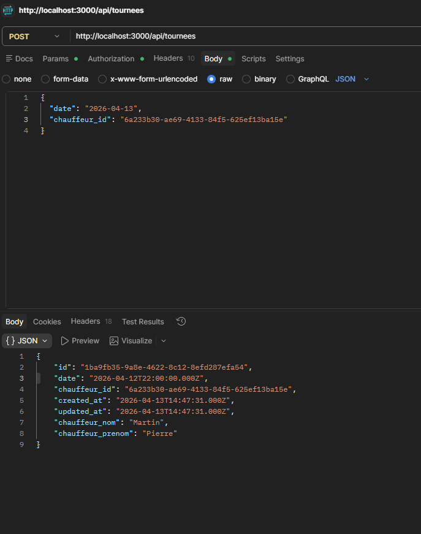
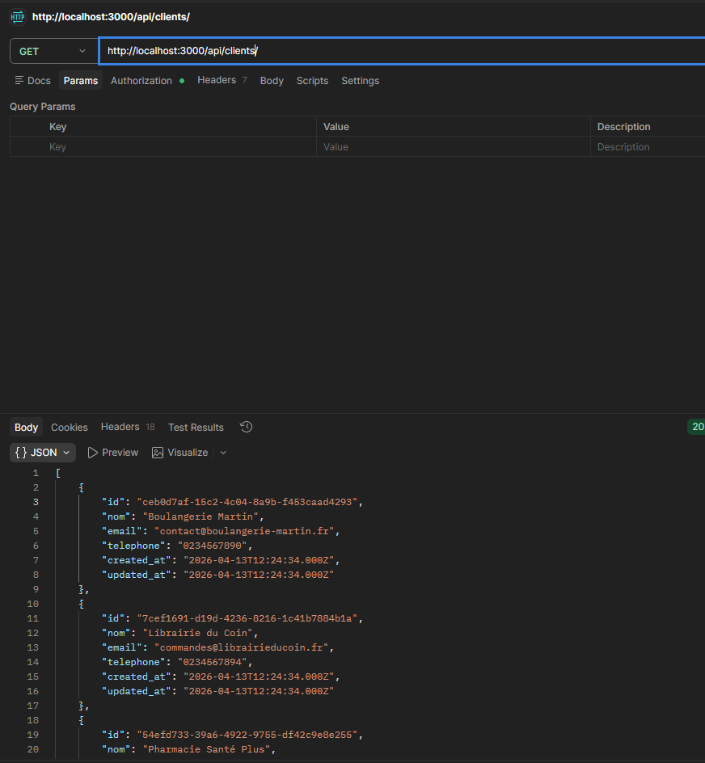
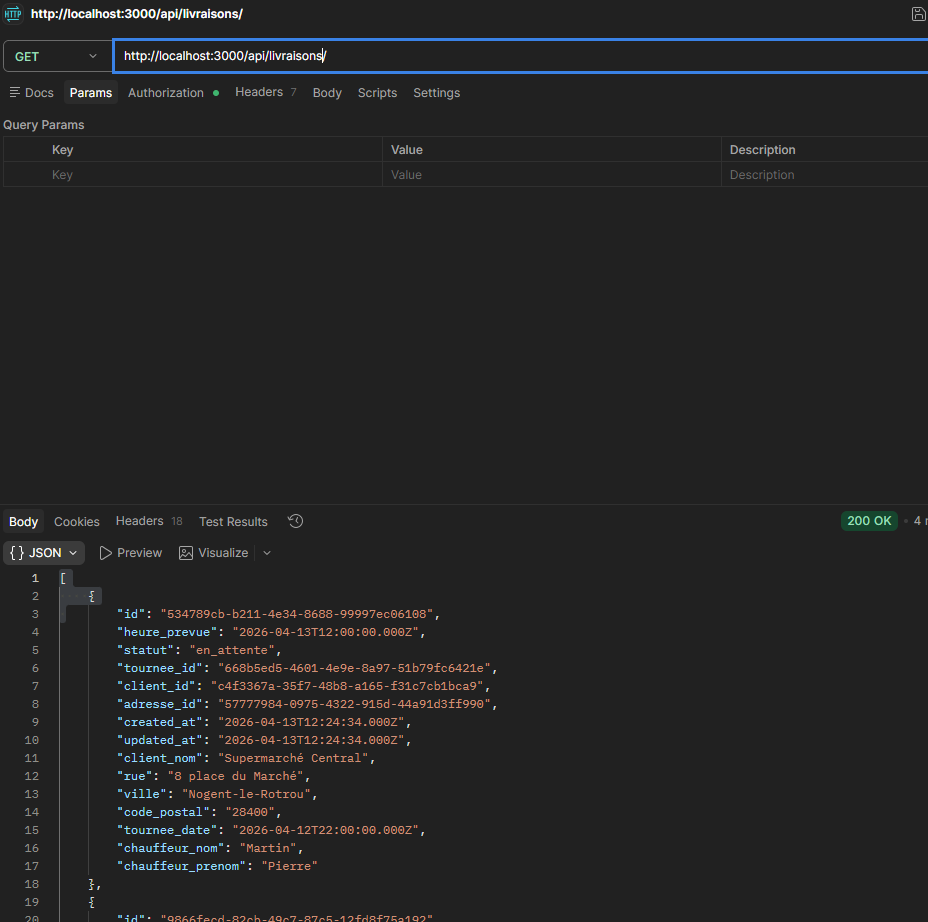
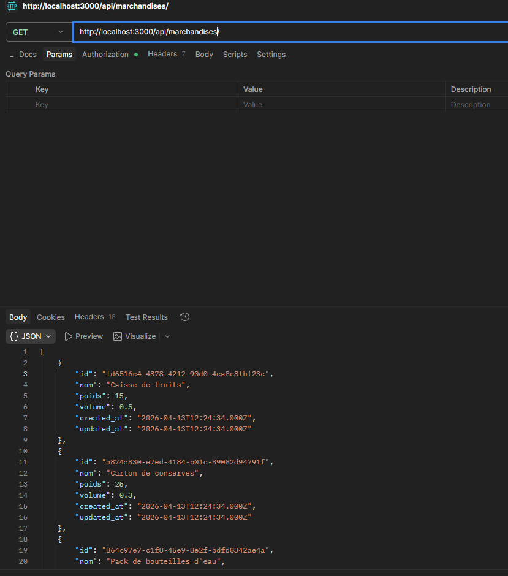
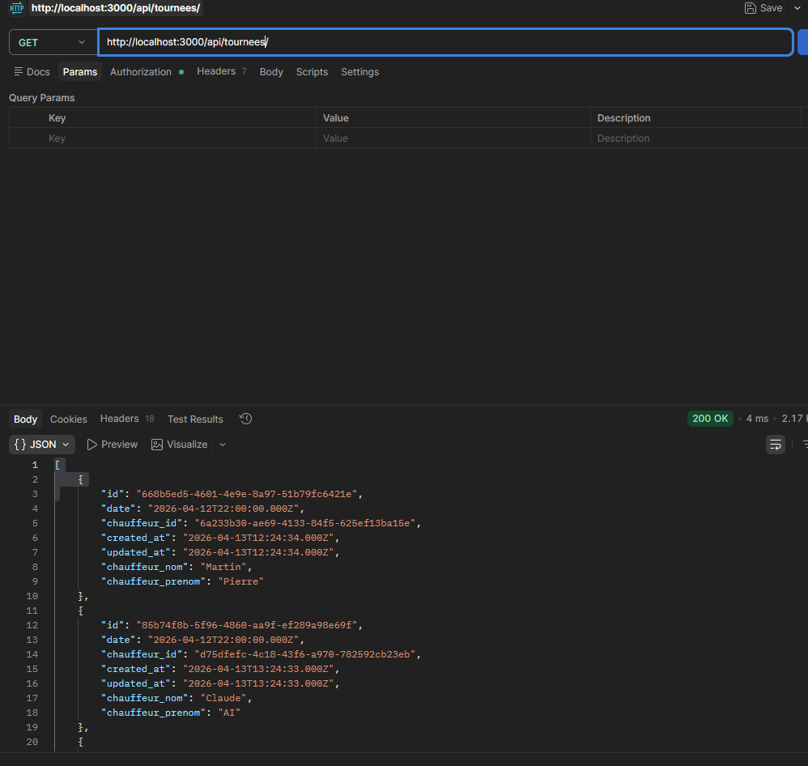

# LEGENDRE Logistique - API et Interface Web

Application de gestion logistique pour l'entreprise LEGENDRE avec API REST et interface web modulaire.

## 🎯 Description

Système complet de gestion des tournées, livraisons, chauffeurs, clients, marchandises et adresses avec authentification par rôles (admin, chauffeur, client).

## 📁 Structure du Projet

```
├── src/                        # Backend Node.js/Express
│   ├── app.js                 # Point d'entrée
│   ├── server.js              # Configuration serveur
│   ├── config/                # Configuration BD
│   ├── controllers/           # Logique métier
│   ├── routes/                # Endpoints API
│   ├── middleware/            # Authentification & sécurité
│   └── swagger.js             # Documentation API
├── database/
│   ├── init.sql              # Schéma BD
│   └── seed.js               # Données de test
├── public/                     # Frontend HTML/CSS/JS
│   ├── index.html            # Page LOGIN uniquement
│   ├── dashboard.html        # Tableau de bord
│   ├── chauffeurs.html       # Gestion chauffeurs
│   ├── tournees.html         # Gestion tournées
│   ├── livraisons.html       # Gestion livraisons
│   ├── clients.html          # Gestion clients
│   ├── marchandises.html     # Gestion marchandises
│   ├── adresses.html         # Gestion adresses
│   ├── css/styles.css        # Styles centralisés
│   └── js/app.js             # Fonctions communes
├── tests/                      # Tests unitaires
│   └── api.test.js           # Suite de tests Jest
├── postman/                    # Collection Postman
│   └── Legendre-API.postman_collection.json
├── .env                       # Variables d'environnement (à créer)
└── package.json              # Dépendances Node
```

## 🚀 Démarrage Rapide

### 1. Installation
```bash
npm install
```

### 2. Configuration
Créer un fichier `.env` à la racine :
```
DB_HOST=localhost
DB_USER=root
DB_PASSWORD=yourpassword
DB_NAME=legendre_logistique
DB_PORT=3306
JWT_SECRET=your_secret_key
PORT=3000
```

### 3. Initialiser la Base de Données
```bash
node database/dump_2026-04-13          # Créer les tables et charger les données
```

### 4. Lancer l'application
```bash
npm start
```

L'app démarre sur `http://localhost:3000`

### 5. (Optionnel) Lancer les tests unitaires
```bash
npm test
```

Tests avec Jest & Supertest - Valide tous les endpoints

## 👥 Utilisateurs de Test

Mot de passe par défaut : **password123**

| Email | Rôle | Usage |
|-------|------|-------|
| admin@legendre.fr | admin | Accès total |
| jean.dupont@legendre.fr | chauffeur | Voir ses tournées |
| pierre.martin@legendre.fr | chauffeur | Voir ses tournées |
| contact@boulangerie-martin.fr | client | Voir ses livraisons |
| commandes@legourmet.fr | client | Voir ses livraisons |

## 🔗 Endpoints API

Tous les endpoints sont préfixés par `/api/`

### Authentification
- `POST /auth/login` - Connexion
- `POST /auth/register` - Inscription
- `GET /auth/me` - Profil courant

### Ressources
- `GET/POST /chauffeurs` - Chauffeurs
- `GET/POST /tournees` - Tournées
- `GET/POST /livraisons` - Livraisons
- `GET/POST /clients` - Clients
- `GET/POST /marchandises` - Marchandises
- `GET/POST /adresses` - Adresses

**Documentation Swagger** : http://localhost:3000/api-docs

## 🏗️ Architecture Frontend

### Navigation
```
index.html (LOGIN)
    ↓ (après connexion)
dashboard.html
    ├── chauffeurs.html
    ├── tournees.html
    ├── livraisons.html
    ├── clients.html
    ├── marchandises.html
    └── adresses.html
```

Chaque page appelle son endpoint API correspondant : `/api/{ressource}`

### Fichiers Partagés
- `css/styles.css` - Design unique
- `js/app.js` - Fonctions communes (API, authentification, helpers)

## 🔐 Authentification

Token JWT stocké dans `localStorage` et envoyé dans chaque requête :
```javascript
Authorization: Bearer <token>
```

Session expirée → redirection vers login

### 📋 Inscription - Créaction Automatique

Lors de l'inscription, selon le rôle choisi :

| Rôle | Champs requis | Action |
|------|---------------|--------|
| **Admin** | Email, Mot de passe | Crée simple account |
| **Chauffeur** | Email, MDP, Nom, Prénom, Téléphone | Crée account + entrée dans table `chauffeurs` |
| **Client** | Email, MDP, Nom, Téléphone | Crée account + entrée dans table `clients` |

**Important** : Un chauffeur ou client créé via inscription est immédiatement disponible pour les CRUD et assignations !

## 🛠️ Technologies

- **Backend** : Node.js, Express, MySQL, JWT
- **Frontend** : HTML5, CSS3, Vanilla JavaScript
- **API** : REST, Swagger/OpenAPI
- **Sécurité** : Bcrypt, CORS, Helmet

## 📝 Fonctionnalités Principales

✅ Gestion complète des chauffeurs, tournées, livraisons  
✅ Suivi du statut des livraisons (en_attente, en_cours, livrée, échouée)  
✅ Permissions par rôle (admin, chauffeur, client)  
✅ Interface responsive et modulaire  
✅ Documentation API interactive (Swagger)  
✅ Tests unitaires automatisés (Jest)  
✅ Création automatique des chauffeurs/clients lors de l'inscription

## 🧪 Tests Unitaires

### Fichier : `tests/api.test.js`
Contient 35+ tests couvrant :
- ✅ Authentification (login/register)
- ✅ CRUD Chauffeurs
- ✅ CRUD Tournées
- ✅ CRUD Livraisons
- ✅ CRUD Clients
- ✅ CRUD Marchandises
- ✅ CRUD Adresses

### Lancer les tests
```bash
# Lancer tous les tests
npm test

# Mode watch (relance auto)
npm test -- --watch

# Output détaillé
npm test -- --verbose
```

**Dépendances** : Jest, Supertest

## 📮 Postman Collection

Une collection Postman complète est fournie dans `/postman/Legendre-API.postman_collection.json`

### Import & Utilisation
1. Ouvrir Postman
2. Clic sur `Import` → Sélectionner le fichier JSON
3. Configurer variables :
   - `base_url` : `http://localhost:3000`
   - `token` : À récupérer après login

### Endpoints testables
- 3 endpoints Authentification
- 5 endpoints par ressource (Chauffeurs, Tournées, Livraisons, Clients, Marchandises, Adresses)
- **Total : 35+ endpoints**

### 📸 Exemples de Tests Postman

#### Vue Admin - Endpoints disponibles


#### Test POST Tournée


#### Gestion Clients


#### Gestion Livraisons


#### Gestion Marchandises


#### Gestion Tournées


## 📌 Commandes Utiles

```bash
npm start          # Lancer le serveur
npm run dev        # Lancer avec nodemon (reload auto)
npm test           # Lancer les tests
node database/seed.js  # Réinitialiser la BD
npm run build      # (À ajouter si nécessaire)
```


## 💡 Architecture & Design

- Chaque page HTML est **indépendante** et modulaire (un fichier par endpoint)
- Appels API avec gestion automatique du token JWT
- Design cohérent via CSS centralisé (`css/styles.css`)
- Code facilement maintenable et extensible
- Separation Frontend/Backend claire

## 🐛 Troubleshooting

| Problème | Solution |
|----------|----------|
| Erreur "Token manquant ou invalide" | Redémarrer le navigateur, vérifier localStorage |
| Chauffeur ne s'ajoute pas | Vérifier que les champs nom, prénom, téléphone sont remplis |
| Tests qui ne passent pas | Exécuter `npm install` puis `node database/seed.js` |
| Erreur de connexion BDD | Vérifier fichier `.env` et config MySQL |
| Port 3000 déjà utilisé | Changer `PORT` dans `.env` |

---

**Besoin d'aide ?** Consultez `/api-docs` pour explorer l'API interactivement ou ouvrez une issue ! 🎯
